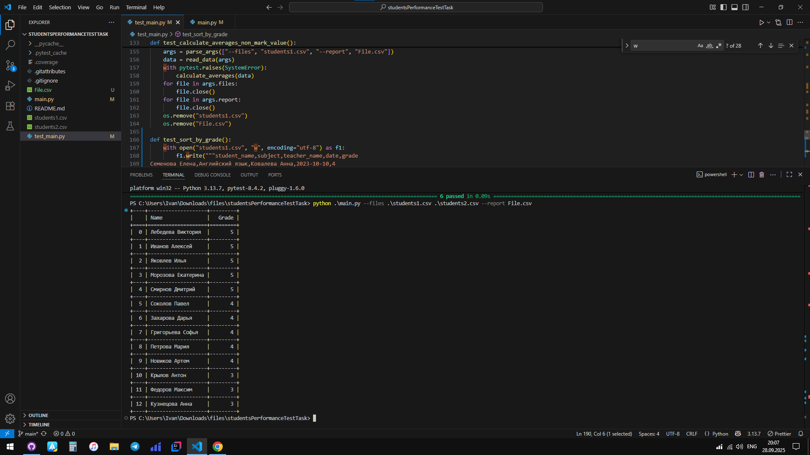

# studentsPerformanceTestTask

Python, csv, argparse, pytest

Запуск
python .\main.py --files .\students1.csv .\students2.csv --report File.csv

Тесты
pytest

Покрытие
pytest --cov

https://docs.google.com/document/d/1Wq7ALJDhin2uY5ldh4srWQFsfJxWUZK_SK4INIwUWug/edit?tab=t.0#heading=h.or54d8e34zbk

В проекте есть readme, примеры запуска, .gitignore. В проекте нет файла с зависимостями, линтера или форматтера. Проект не разбит по модулям, вся функциональность в одном файле. Используется контекстный менеджер, что верно.  Аннотации не используются. Используется try/except или исключения. Для валидации названия отчетов можно было использовать choices в argparse. Не используется ООП. Не используются абстрактные классы или протоколы, можно было с их помощью описать отчёты. Не используется @pytest.fixture. Не используется @pytest.mark.parametrize.